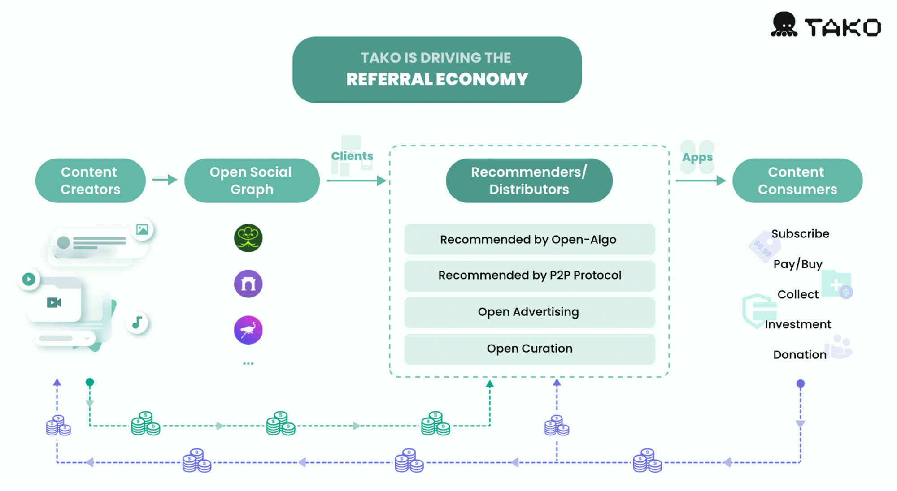

# What is Tako?

Tako is an open recommendation protocol, designed to cater to the paradigm shift in content recommendation and distribution from traditional social networks to Web3 social graphs.&#x20;

The Tako Protocol aims to counter centralization issues with a peer-to-peer and value-matching recommendation model. Compared to centralized models, this approach offers content creators a more personalized and efficient way to reach their target audiences and monetize user-targeted advertisements.

This shift from 'Platform as a Curator' to 'User as a Curator' enables all participants to earn rewards by contributing to a Referral Economy, where value is channeled directly to users, and jointly facilitating the content value flow in Web3 Social.

<figure><figcaption></figcaption></figure>

Tako's core principles, embedded in its open-source code, are designed to empower users and ensure that recommendations are permissionlessly created, improved, and governed by users:

*   **User-Centric**

    Embracing the concept of 'User as a Curator', Tako allows all types of users, including content creators, curators, and consumers, to participate in the recommendation process. Users can curate or promote any content they value and have full control over their social experience, aligning it with their interests.
*   **Value-Matching**

    By adding ”value“ to the content, each recommendation in this ecosystem is curated after careful evaluation. This value-matching recommendation model boosts content liquidity and its value flow in Web3 Social, fostering a more vibrant and organic sharing and recommendation environment.
*   **Seamless Multi-ecosystems Experience**

    Tako is meticulously designed for compatibility with virtually any open social protocol and multiple blockchains. It frees users from the constraints of single platforms or social networks, and provides developers with efficient integration of Tako APIs. Tako thus provides an expansive environment for content creators and audiences to connect without barriers.
